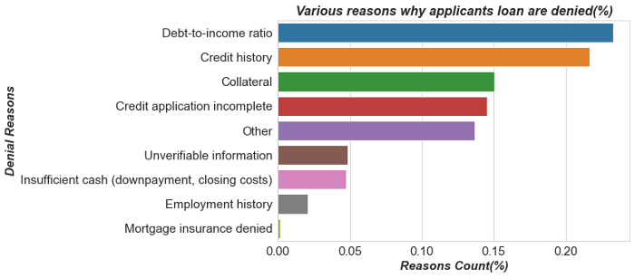

Liked it? Please give a ⭐️ to build this 💪 stronger.
# 👋 Introduction
<p align="center">
    <a href="https://kuleafenu.medium.com/how-to-improve-your-chances-of-getting-a-mortgage-loan-50df90796c45" target="blank"/>
        
    </a>
</p>

`Project Goal`: we will perform Data Exploration to discover the main factors affecting applicant’s mortgage loan approval rate using python by asking the right questions.

# 💻 Published on medium
Please read all the insights from this medium page.
> [How to improve your chances of getting a Mortgage Loan](https://kuleafenu.medium.com/how-to-improve-your-chances-of-getting-a-mortgage-loan-50df90796c45)


# 🔥 What you will learn
- Understanding the concept of Mortgage.
- Setting up Environment
- Knowing your Data, features and labels
- Exploratory Data Analysis
- Conclusion
- ,etc


## 🔢 Information Summary
- Credit history and Debt-to-income ratio emerged as the principal factor in securing a loan, hence applicants should maintain a good debt-to-income ratio and also build good credit history.
- Unfortunately, it turned out that high-income earners have an edge over the lower-income group. So you may consider taking a high-income job though it’s not a major requirement.
- In choosing the property, make sure your median income is higher than the median neighborhood income of where the property is located.
- Choose to buy a multifamily dwelling. Don’t apply for a loan to buy manufactured housing since that has a very low rate of mortgage approval.
- Apply for FSA/RHS loans. It has a relatively high chance of loan approval over the rest types.
- Consider getting a Home loan in King County.
- Apply for a loan to purchase a house; a Home Purchase loan has a significant approval rate.
- If you want a 100% rate of approval for your loan, then, apply for HOEPA loans.
- Secure your loan through the first lien.
- Black or African Amerian has a good chance of applying with a white American, Asian or Native Hawaiian.

# 🏗️ How to reproduce the project
You can run this code locally with a few easy steps.

1. Clone the repository

```bash
https://github.com/kuleafenu/exploratory-data-analyisis-on-medium-post.git
```

2. Install dependencies

* [NumPy](http://www.numpy.org/)
* [IPython](http://ipython.org/)
* [Pandas](http://pandas.pydata.org/)
* [SciKit-Learn](http://scikit-learn.org/stable/)
* [Matplotlib](http://matplotlib.org/)


3. Open the the notebook file and run the cells.

# 🛡️ License
This project is licensed under the MIT License - see the [`LICENSE`](LICENSE) file for details.

# 🙏 Support

We all need support and motivation. Please give this project a ⭐️ to encourage and show that you liked it. Don't forget to leave a star ⭐️ before you move away.
